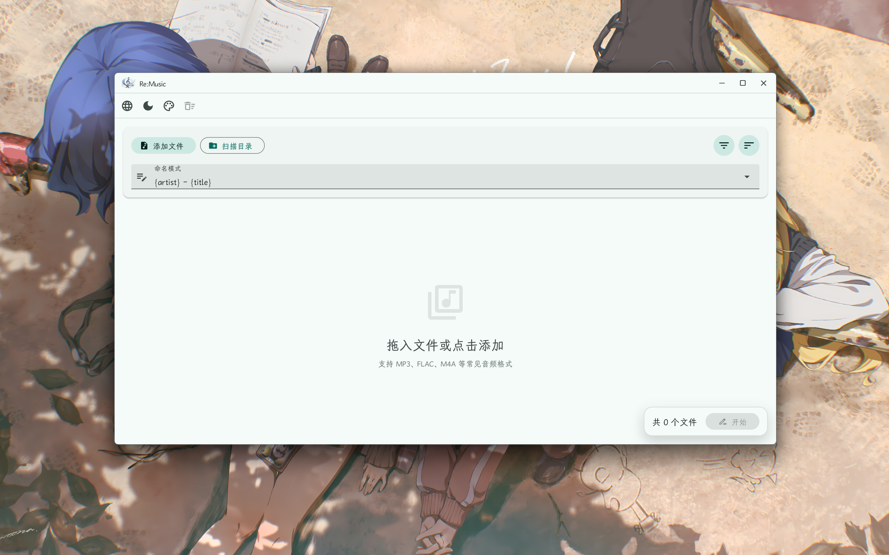
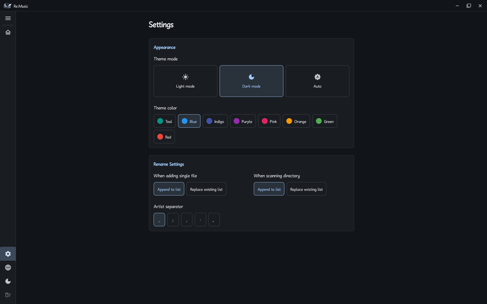

# Re:Music

<p align="center">
  
</p>

<p align="center">
  <b>A modern audio file management tool with batch renaming, tag editing, and audio resampling</b>
</p>

<p align="center">
  <b>English</b> | <a href="docs/README/README.zh-CN.md">简体中文</a>
</p>

---

## Introduction

**Re:Music** is a native desktop audio file management tool built with Flutter. It supports batch renaming based on audio metadata, music tag editing, online metadata retrieval (WIP), and audio resampling with format conversion (WIP)

## Preview

<p align="center">
  
</p>
<p align="center">
  
</p>

## Key Features

*   **Batch Renaming**: Supports reading audio metadata and provides flexible renaming rule configuration
*   **Music Tag Editing**: Allows editing of audio metadata, with batch modification and saving capabilities
*   **Online Metadata Retrieval (WIP)**: Fetch song tags and cover art from online sources
*   **Audio Resampling (WIP)**: Lossless audio downsampling for improved compatibility.
*   **File Management**: Supports drag-and-drop import of folders or files, file list filtering, and sorting
*   **Personalization**: Built-in light and dark modes, multiple MD3 color modes, and support for Chinese and English
*   **Responsive Layout**: Left sidebar that auto-collapses when the window is narrow

## Constants Management

All constants used in the application are centrally managed in `lib/constants.dart` for easy maintenance and consistency

## Supported Formats

**Re:Music** supports various common audio file formats:

*   **MP3** (`.mp3`)
*   **FLAC** (`.flac`)
*   **M4A / AAC** (`.m4a`, `.aac`)
*   **OGG / Opus** (`.ogg`, `.opus`)
*   **WMA** (`.wma`)
*   **WavPack** (`.wv`)
*   **DSD** (`.dsf`, `.dff`)

## Tech Stack

This project is built with **Flutter** and primarily uses the following technologies and libraries:

*   **Framework**: [Flutter](https://flutter.dev/) (Windows Desktop)
*   **Language**: Dart
*   **State Management**: `provider`
*   **Core Dependencies**:
    *   `audio_metadata_reader`: Audio metadata reading.
    *   `audiotags`: Audio metadata writing.
    *   `window_manager`: Desktop window management.
    *   `file_picker`: File picker.
    *   `intl`: Internationalization.
    *   `provider`: State management.
    *   `path`: Path handling.

## Getting Started

### Prerequisites

Ensure your development environment has:
*   Flutter SDK (3.38.6+)
*   Visual Studio C++ Tools

### Running and Development

1.  **Clone the project**
    
    ```bash
    git clone https://github.com/ChuwuYo/Re-Music.git
    cd Re-Music
    ```

2.  **Manage Dependencies**
    *   Install dependencies: `flutter pub get`
    *   Update dependencies: `flutter pub upgrade`

3.  **Run**
    
    ```bash
    flutter run -d windows
    ```

### Build and Release

#### 1. Automated Build (Recommended)
This project provides a PowerShell script that automatically increments the build number and completes the Release compilation:

```powershell
.\build.ps1 -Version "0.0.1"
```

#### 2. Manual Portable Build

```bash
flutter build windows --release
```

The build artifacts are located in the `build/windows/runner/Release/` directory
Distribute this folder directly as a zip file

#### 3. Installer
To generate an installer like `.exe`, you need to use third-party tools (such as NSIS / Inno Setup) to package the portable build files
*Note: This project currently does not integrate an automatic packaging script*

## License

MIT LICENSE

Copyright © 2026 ChuwuYo. All rights reserved.
